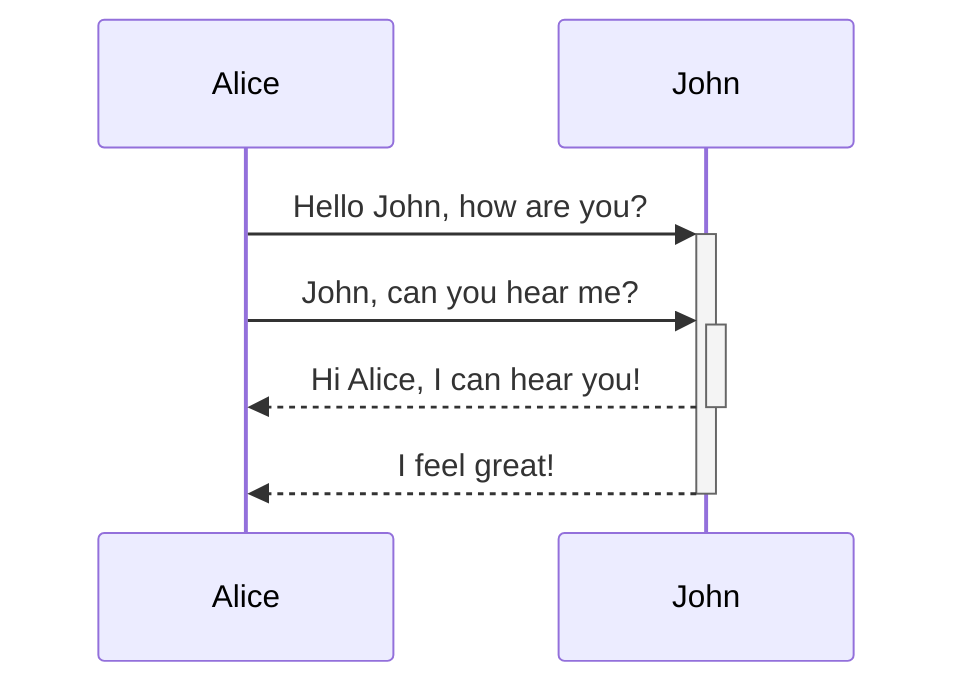
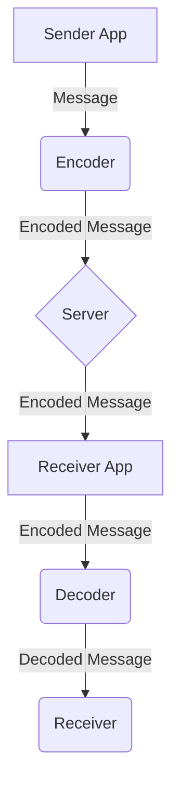

# Dating-App

## End-to-end encryption chat simulation final year project.

## System Design

In this project I used ***Firebase*** as the server and for frontend, I used android xml. 

* The app is designed to accomodate almost all screen sizes in mobile and tablet devices.
* It has a persistent server which means even if you lose network, whenever the internet connection is live again it will receive and send message automatically.
* Chats are stored on the local database using ***Android*** and ***SQLite***.

* Server only holds the message as long as the receiver is offline.
* Messages sent to server are encrypted on the client device first and then decoded on the receiver device. 

## System GUI

The app is easy-to-use and user-friendly. Everything is labeled and easy to access.

>The app is under development.

* **Profiles** Screen comes first after loading screen. 
 
* You can click on the user profile card to interact with the user. 
  
 
* Heart icon represents **Favourite selection**, you can mark any user as Favourite and it will show in your Favourite tab which you can access from your dashboard. 
 
* Chat Dialog icon will let you chat to the other user and also that user will be shown in your chat tab which can be accessed from the dasboard.
* These are **Account Options** here you can edit your profile, logout and upload photos to the server. 
  
* By clicking on **Edit Profile** option you can edit your profile.  
* For Example we will first turn the swith on and then click on the field you want to edit. 

 
>Some features are under development.

### Overall the app was designed to only simulate a part of end-to-end encryption using AES-128 with ECB Packaging.
